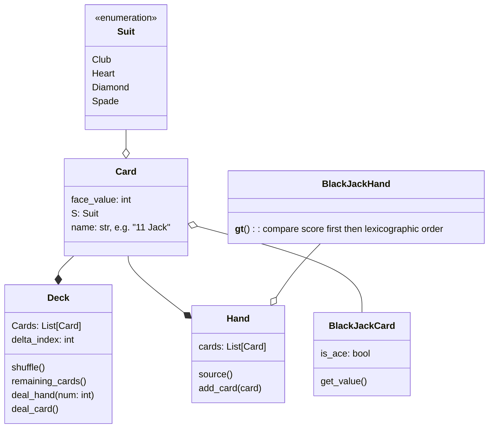

# BlackJackCards

```mermaid
classDiagram

Suit --o Card
Card --* Deck
Card --* Hand
Card o-- BlackJackCard
BlackJackHand --o Hand

class Suit {
  <<enumeration>>
  Club
  Heart
  Diamond
  Spade
}

class Card {
  face_value: int
  S: Suit
  name: str, e.g. "11 Jack"
}

class Deck {
  Cards: List[Card]
  delta_index: int

  shuffle()
  remaining_cards()
  deal_hand(num: int)
  deal_card()
}

class Hand {
  cards: List[Card]
  source()
  add_card(card)
}

class BlackJackHand {
  __gt__(): compare score first then lexicographic order
}

class BlackJackCard {
  is_ace: bool
  get_value()
}

```

