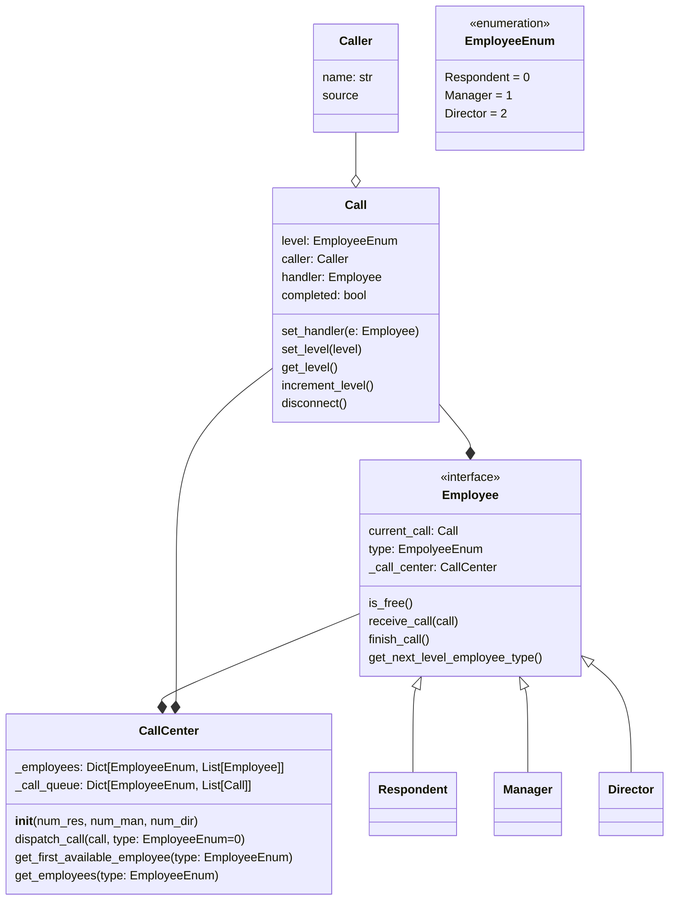

# Call Center

## Comments

- Employee - receive_call: if call.level > type, call center dispatch the call with higher level
- CallCenter can either be a singleton and global variable. Or used as a private member of Employee
